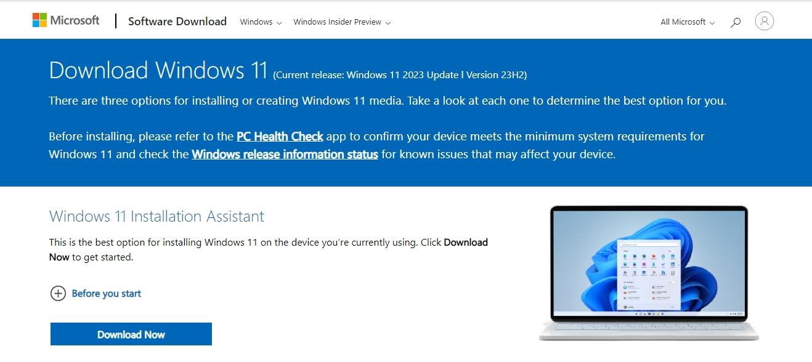
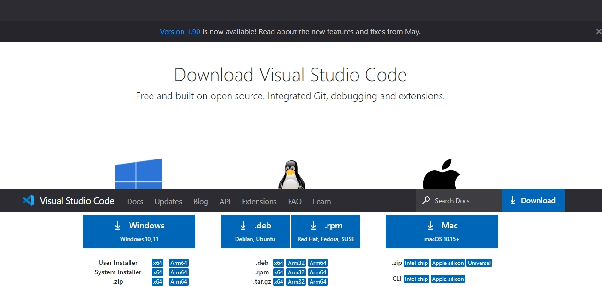
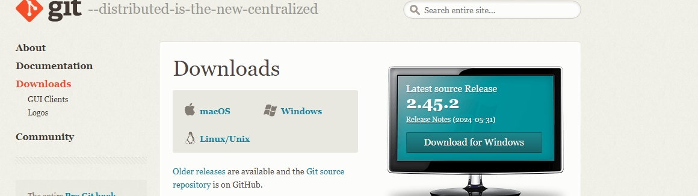
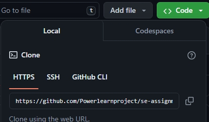
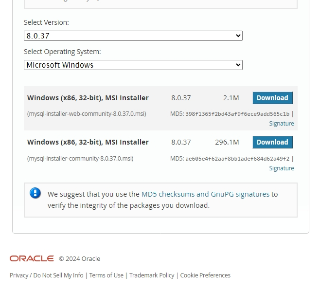

1. Select Your Operating System
Task: Choose and install an operating system. For this project, we will use Windows 11.
Luckily My laptop was already up to date, with Windows 11 this was confirmed after downloading the Windows 11 installation assistant.

2. Install Visual Studio Code
Task: Download and install Visual Studio Code (VS Code).

Steps:
Download VS Code:

Visit the VS Code download page.
Select the appropriate version for Windows and download the installer.
Install VS Code:

Add Visual studio Code extensions for a smoother experience.

3. Set Up Version Control System
Task: Install Git, configure it, and initialize a Git repository.

Steps:
Install Git:

Visit the Git download page.
Download and run the Git installer.
Follow the installation steps, choosing the default options.

I then confirmed that I had installed the correct git version since it was installed some time back.

Create a GitHub Account:

Visit GitHub and sign up for a free account if you don’t already have one.
I already had mine installed.

Clone the Repository:

Open a terminal or Git Bash.
Navigate to the directory where you want to store your local copy of the repository:
Run the clone command:
Navigate to the cloned repository:

4. Install Necessary Programming Languages and Runtimes
Task: Install Python and other required programming languages and tools.

Steps:
Download Python:

Visit the Python download page.
Download the latest version of Python.
Install Python:

Run the installer and ensure you check the box to "Add Python to PATH."
Follow the installation steps.
Verify Installation:
Ensure the installed version is displayed.

5. Install Package Managers
Task: Install package managers like pip for Python.

Steps:
Verify pip Installation:

pip is installed by default with Python. Verify it by running:

6. Configure a Database (MySQL)
Task: Download and install MySQL, configure it, create a database and user, and connect it with your project.

Steps:
Download MySQL:

Visit the MySQL download page.
Download the MySQL Installer.
Install MySQL:

Run the downloaded installer.
Choose the "Developer Default" setup type.
Follow the installation steps, setting the root password and creating a MySQL user if prompted.
Complete the installation.

Logged in to MySQL and created a database.

Intergrate MySQL with project
Installed MySQL connector for python

10. Reflection on Challenges and Solutions
Challenges Faced:
1.Making sure that my python and MySQL were in the correct path took a lot of trial and error.

Strategies Employed:
Detailed Step-by-Step Guide: Ensuring every step is documented clearly with accompanying screenshots.
Troubleshooting: Referencing official documentation and online resources for troubleshooting any issues encountered.

